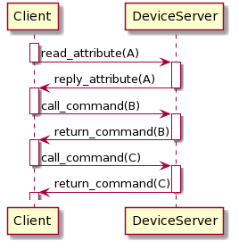
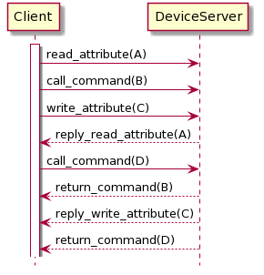

This document describes The Request-Reply protocol. The Request-Reply protocol provides a two way in which the Tango 
Controls clients and servers communicate with each other.

See also: Y/OtherTemplate

## Preamble

Copyright (c) 2019 Tango Community.

This Specification is free software; you can redistribute it and/or modify it under the terms of the GNU General Public 
License as published by the Free Software Foundation; either version 3 of the License, or (at your option) any later 
version. This Specification is distributed in the hope that it will be useful, but WITHOUT ANY WARRANTY;
without even the implied warranty of MERCHANTABILITY or FITNESS FOR A PARTICULAR PURPOSE. See the GNU General Public 
License for more details. You should have received a copy of the GNU General Public License along with this program; 
if not, see <http://www.gnu.org/licenses>.

This Specification is a [free and open standard](http://www.digistan.org/open-standard:definition) and is governed by 
the Digital Standards Organization's [Consensus-Oriented Specification System](http://www.digistan.org/spec:1/COSS).

The key words "MUST", "MUST NOT", "REQUIRED", "SHALL", "SHALL NOT", "SHOULD", "SHOULD NOT", "RECOMMENDED", "MAY", 
and "OPTIONAL" in this document are to be interpreted as described in [RFC 2119](http://tools.ietf.org/html/rfc2119).

## The Request-Reply protocol Specification

The Request-Reply protocol defines:
* types and content of messages sent between Tango Controls objects,
* communication sequences,
* rules for establishing and tearing-down network connections.

### Goals

The Request-Reply protocol aims to standardise way of exchanging data between Tango Clients and Device Servers in 
a pattern where a client sends a request and the server reply with an answer. It SHALL allow for reading and writing 
Attributes and Pipes as well as for executing Commands.

Additionally, it aims to:

* Be independent of network transport/binary protocol,

* Define a rules for transparent reconnection,

* Allow for initiation and management of other communication protocols (like Publishe-Subsciber protocol) .

### Use Cases

There are few main use cases for The Request-Reply protocol:

* Calling Commands on Devies,
* Reading Attributes' and a Pipes' values and meta-data,
* Writing Attributes' and Pipe's data,
* Setting-up Publisher-Subscriber communication,

## Specification

### Client duty
#### Reconnection

The client SHALL manage connections to any Device Servers it is using.

When sending any request to a Device Server the client:
* SHALL check if the connection to the Device Server is established and active,
* if the connection is not yet established or broken, the client SHALL try to connect to the Device Server,
* if the connection cannot be made within a specified time defined by a user (timeout) the client SHALL inform the user by throwing a DevFailed exception,
* if the connection is established and active, the client SHALL use this connection to send the request,
* if the client get no response within a certain time defined by a user (timeout) the connection SHALL be set to broken (teardown) and the client SHALL inform the user via throwing a DevFailed exception,
* the client SHALL respond adequately to any information on the connection state changes provided by the connection itself (e.g. os level exceptions). 

* The Request-Reply protocol SHALL implement Transparent Reconnection mechianism on the client side. Transparent Recconection is hidding temporary connection issues by re-trying of connection establishement.

* The Client MAY opt-out from using Transparent Reconnection.

### Version compatibility
TODO describe here in which condition
TODO decide which version the specification should focus on i.e version 5

### Protocol
#### Message
SHOULD include:
* client process idendification i.e pid
* source

#### Exception

Certain conditions may prevent a Request to be handled properly.

* If a Request cannot be handled properly, the Client SHALL be notified by receiving of a DevFailed or MultiDevFailed exception (see [9/DataTypes.md](/9/DataTypes.md#Exceptions)).
* The DevFailed exception MAY be generated by either a Client (API) or a Device Server.
* Exceptions MAY be raised either by API code or by a user provided code.
* The Request Reply Protocol SHALL provide mechanism of sending a DevFailed or MultiDevFailded exception from a Device Server to a Client.
* If a Device Server throws a (Multi)DevFailed exception upon request processing, the exception SHALL be sent to the Client which sent the request.
* If a Client receives a (Multi)DevFailed exception it SHALL be available (rethrown) to user (code).

#### Timeout
#### Synchronous request

The client MAY send Synchronous Requests. 

When the client sends a Synchronous Request it SHOULD wait for a request to be processed.

If one client thread sends multiple Synchronous Requests sequentially, these SHALL be processed in the same order as these have been sent.

The client SHALL handle the Synchronous Request in the way that it blocks the calling client 
thread until the request is fully processed (a Device Server reply to the request and the result is 
available to the client) or timeout or other error appear.

Below is a diagram showing an example seqence: 

The client MAY allow multiple Synchronous Requests to be sent in parallel if these are sent by multiple client threads.

The Device Server MAY process multiple synchronous requests in parallel according to its [Serialisation](Serialisation).

#### Asynchronous request

The client MAY send Asynchronous Requests.

When the client sends an Asynchronous Request it MAY not wait for the request to be processed before sending another request.

The client thread which sends an Asynchronous Request MUST NOT be blocked for a time of the request being processed (except for a time needed for the request registration).

A result of the Asynchronous Request SHALL be available for the client.

The client SHALL be informed when the result of the Asynchronous Request is available.

The client MAY decide whether to process the result of Asynchronous Request:
* as soon as it is available (for example in the call-back pattern),
* or when it decides to process,
* or skip processing of the result. 

Below is a diagram showing an example seqence of Asynchronous Requests: 

A Device Server SHALL process any incoming requests in the order of their arrival and according to its [Serialisation](Serialisation).

#### Cache

#### Serialization

The Serialization Mode defines how the Device Server handles multiple requests. 

The Serialization SHALL apply to all requests independently of a request origin (any network host, localhost, the same Device Server process). 

A Device Server MAY handle requests with the following Serialization Modes:
* Serialization by Device
* Serialization by Class
* Serialization by Process
* No Serialization

When a Device Server is set to Serialization by Device:
* it SHALL process requests to each Device in the order of requests arrival,
* for any Device in the Device Server, it MUST NOT start the processing of a new request until the processing of the previous request is not finished,
* it MAY process multiple requests in parallel, providing that there is maximum one processed request per a Device.

When a Device Server is set to Serialization by Class:
* it SHALL process requests to each set of Devices belonging to the same Class in the order of requests arrival,
* for each Device Class, it MUST NOT start the processing of a new request until the processing of the previous request is not finished,
* it MAY process multiple requests in parallel, providing that there is maximum one processed request per Device Class.

If Device Server is set to Serialization by Process:
* it SHALL process requests in the order of requests arrival,
* it MUST NOT start the processing of a new request until the processing of the previous request is not finished,

The Device Server SHOULD process requests as soon as possible. If an incoming request cannot be processed due to Device Server 
Serialisation Mode it SHOULD be queued for later processing and served as soon as possible.

If Device Server is set to No Serialization it MAY process any requests in parallel. 
It is NOT RECOMMENDED to use No Serialization mode. 

The default serialization Mode is "Serialization by Device".

### Blackbox
A blackbox system should record every REQUEST on the Device especially:

Attribute case
* Read Attribute request,
  Should register the attribute name, the id of the client (often the pid), the version of TANGO and the Source (DevSource)
* Write or WriteRead Attribute request,
  Should register the attribute name, attribute value (only for writing?) (AttributeValueList_4), the id of the client (often the pid) and the version of TANGO
* reading an Attribute configuration # (Op_Get_Attr_Config)
* changing an Attribute Configuration # (Op_Set_Attr_Config);
* Read the Attribute History 

Pipe case
* Read Pipe request,
  Should register the pipe name, the id of the client (often the pid), the version of TANGO and the Source (DevSource)
* Write Pipe request,
  Should register the pipe name, attribute value, the id of the client (often the pid) and 0?, the version of TANGO_PIPE? 
* WriteRead Pipe request,
  Should register the pipe name, attribute value, the id of the client (often the pid) and 1?, the version of TANGO_PIPE? 
* reading an Pipe configuration # (Op_Get_Pipe_Config_5);
* changing an Pipe Configuration # (Op_Set_Pipe_Config_5);
* Read the Pipe History 

Command case
* listing the list of Command Name [//]: #  (Op_Command_list);
* execute a Command Name
Should register the command name, the id of the client (often the pid), the version of TANGO and the Source (DevSource)

* any operation like reading the request of Command History [//]: #   Op_Command_inout_history_4,

Operations case:
* reading the BlackBox itself #  (Op_BlackBox);
* reading the device (Attribute?) name # (Attr_Name)
* request the adm_name attribute # (Attr_AdmName);
* request thedescription attribute # (Attr_Description);
* read the information of a device command  # (Op_Command);
* read the information of a device # (Op_Info);
* executing Ping # (Op_Ping);

NOTE All GROUPED REQUESTS should be logged once with the same information as the unique request

### Connection management

* The Reqest-Reply protocol SHALL manage client connection.

#### Connection establishement

#### Serving multiple devices 

#### Serving for multiple client connections

#### Staled connections

#### Transparent reconnection on client side
