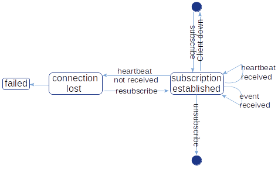
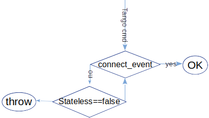

## Preamble

Copyright (c) 2019 Tango Controls

This Specification is free software; you can redistribute it and/or modify it under the terms of the GNU General Public License as published by the Free Software Foundation; either version 3 of the License, or (at your option) any later version. This Specification is distributed in the hope that it will be useful, but WITHOUT ANY WARRANTY; without even the implied warranty of MERCHANTABILITY or FITNESS FOR A PARTICULAR PURPOSE. See the GNU General Public License for more details. You should have received a copy of the GNU General Public License along with this program; if not, see <http://www.gnu.org/licenses>.
x
This Specification is a [free and open standard](http://www.digistan.org/open-standard:definition) and is governed by the Digital Standards
Organization's [Consensus-Oriented Specification System](http://www.digistan.org/spec:1/COSS).

The key words "MUST", "MUST NOT", "REQUIRED", "SHALL", "SHALL NOT", "SHOULD", "SHOULD NOT", "RECOMMENDED", "MAY", and "OPTIONAL" in this document are to be interpreted as described in [RFC 2119](http://tools.ietf.org/html/rfc2119).

## Introduction

This document describes the Tango Publisher-Subscriber protocol. It is a relationship between Tango client (client) and Tango server (server). Based on criteria negotiated as part of a subscription, Tango client will receive updates. Beyond a set of basic requirements, various refinements are addressed. These refinements include: periodicity of updates, filtering out updates based on Tango server configuration and fault tolerance. 

## Basic Concepts

> This probably should go into RFC-1 and just referenced here

This documents refers to other Tango Controls RFCs, corresponding link is always given in this case. Here is given a brief description of the main concepts. This document targets arbitrary software developer(s) who are to implement *Tango Client Library* and *Tango Server Library*.

*Tango Server* (server) - a process that runs on a machine.

*Tango Device* (device) - a thread within a *Tango Server* that implements *Tango Class* i.e. has *Tango Commands, Attributes, Pipes, Properties*  etc.

*Tango Admin Device* (admin) - a pre-defined *Tango Device* i.e. a *Tango Device* with fixed number *Tango Commands, Attributes, Pipes* [RFC-3, RFC-4,RFC-?]  etc.

For more details see [RFC-2](https://github.com/tango-controls/rfc/blob/draft/2/README.md)

*Tango Client* (client) - a process that instantiates communication with *Tango Server* using Request-Reply protocol [RFC-10].

*Tango Client Library* (client kernel library) - library that encapsulates communication with *Tango Server* and provides *Tango Client API* to a user.

*Tango Client API* (client API) - an API that user uses to develop applications based on communication with *Tango Server*s. 

*Tango Server Library* (server kernel library) - library that encapsulates *Tango Server* features and provides *Tango Server API* to a user.

*Tango Server API* (server API) - an API that user uses to develop *Tango Device* functionality.

*Upstream Tango Server/Device* (upstream server/device) - a *Tango Device* to which updates *client* subscribes for.  

*Polling thread* (polling thread) - a thread within *Tango Server* that polls periodically defined *Tango Device*'s attributes/sometimes commands.

*Tango Publish-Subscriber protocol* (pub-sub) - is a sub-set of *Tango Client-Server protocol* [RFC-?] that defines a relationship between *client* and *server* established via a negotiation phase and lasts till explicitly broken. During this relationship client receives updates published by *upstream server*. Updates are sourced from server's *polling thread* or directly through *server API*. Updates are filtered according to *device*'s configuration.

*Tango Event* (event) - an update sent by *server*.

*Tango Event Callback* (callback) - a piece of code that *client library* executes when an update is received.

*Channel* - virtual client-server point-to-point connection for transmitting events

## Definitions

This section offers a number of ABNF formal definitions for entities repeatedly used below in this document.

> **NOTE**: in the below ABNF some basic definitions are used as rules, spaces are replaced with '_' 

> **NOTE**: in the below ABNF data types sometimes embeded into the rule e.g. bool:isExcept is equivalent to isExcept = true / false

```ABNF    
endpoint = URL ; usually with port

SUBSCRIBER_INFO = upstream_device attribute_name action EVENT_TYPE client_idl_ver                                                                                                 
                                                                
SUBSCRIPTION_INFO = server_library_release_ver upstream_device_idl_ver zmq_sub_event_hwm rate ivl zmq_release_ver heartbeat_endpoint event_endpoint 1*alternate_heartbeat_endpoint 1*alternate_event_endpoint HEARTBEAT_CHANNEL EVENT_CHANNEL
              
EVENT_INFO = EVENT_DATA/1*EVENT_ERROR bool:isExcept  ; see below

EVENT_DATA = ATT_CONF_DATA/PIPE_DATA/DATA_READY_DATA/INTERFACE_CHANGE_DATA/ATTRIBUTE_DATA 
             
ATT_CONF_DATA = ATTRIBUTE_PROPERTIES ; Attribute properties from RFC-4, see link below

PIPE_DATA =  int:size name timeVal PIPE_BLOB ; Pipe blob must be defined in RFC-7

DATA_READY_DATA = attribute_name data_type int:counter

INTERFACE_CHANGE_DATA = *ATTRIBUTE_PROPERTIES *COMMAND_META_INFO bool:deviceStarted

ATTRIBUTE_DATA = ATTRIBUTE_DEFINITION ; Attribute definition from RFC-4 

EVENT_ERROR = reason severity desc origin

EVENT_TYPE = "QUALITY_EVENT"/"INTERFACE_CHANGE"/"PIPE"/"ATTR_CONF_EVENT"/"CHANGE_EVENT"/"PERIODIC_EVENT"/"ARCHIVE_EVENT"/"USER_EVENT"/"HEARTBEAT"

EVENT_CHANNEL = channel

HEARTBEAT_CHANNEL = channel

channel = string ; impementation specific
```

> **NOTE:** pipeBlob should be referenced to RFC-7 Pipes

[RFC-3 Command model](https://github.com/tango-controls/rfc/blob/draft/3/README.md#specification)

[RFC-4 Attribute model, attribute properties](https://github.com/tango-controls/rfc/tree/draft/4#attribute-properties)

[RFC-4 Attribute model, attribute definition](https://github.com/tango-controls/rfc/blob/draft/4/README.md#attribute-definition)

> **NOTE**: In Tango V9 EVENT_DATA MAY include source idl version, event type  

## Runtime requirements

Client and server are up and running. Server is reachable from client i.e. may communicate using Request-Reply protocol [RFC-10]. 

## Publisher-Subscriber protocol



The main goal of the this protocol implementation is to allow client receive events from server:

* Server MUST publish events of EVENT_TYPE

* Server library MUST provide an API to publish events of EVENT_TYPE

* Client SHOULD process events

* Client library SHOULD provide user an API to register user defined event callbacks  

### Negotiation



Negotiation phase implies that client and server exchange required data using Tango commands [RFC-3, RFC-13]:

* Client MUST notify server providing SUBSCRIBER_INFO to establish Publisher-Subscriber relationship

  > in Tango 9 the above is done by executing EventSubscriptionChange admin command  
                                                                                                        
  > Tango 9 forces client to explicitly execute ZmqEventSubscriptionChange to use ZMQ based implementation [RFC-13]                                                                                                              

* Server MUST respond to the client providing SUBSCRIPTION_INFO

* Client MUST connect to upstream server using provided SUBSCRIPTION_INFO

* Client SHOULD postpone event subscription process in case of connection failure and try again later 

Tango Event System uses concept of channels for delivering events. Channel is established between client and admin. There are two channels per subscription: heartbeat and event.

* Client MUST establish channel or multicast connection to heartbeat/event endpoints

* Server MAY send and client MAY iterate over alternative heartbeat/event endpoints to establish connection

* Client MAY NOT use provided heartbeat/event channels to identify event source 

### Subscription 

* Server MUST send events via corresponding EVENT_CHANNEL

* Server MUST send HEARTBEAT via corresponding HEARTBEAT_CHANNEL event every 9 seconds

* Client SHOULD indicate its interest in subscription not later than every 600s

### Cancel event subscription

* Client MAY cancel its subscription

* Server SHOULD NOT send events to client whose subscription is canceled

### Fault tolerance

Tango Pub-Sub protocol implies a number of fault tolerance techniques:

- server heartbeat
- transparent client reconnection
- client subscription confirmation
- events client/server buffer

* Client SHOULD try to re-subscribe once HEARTBEAT event is missing

* Client MAY try to re-subscribe indefinitely

* Server MAY cancel client's subscription if it does not confirm its interest

* Client/Server SHOULD implement (in/out)coming events buffer to prevent overload 

* Client/Server MUST prevent crash in case events overflow

* Client SHOULD be notified in case of missing events 

  > e.g.: In the current C++ implementation at least, the client callback is executed with an API_MissedEvents error event when the client library detected that some events got lost. There is a mechanism with some counters associated with each event to help detecting this kind of problems
